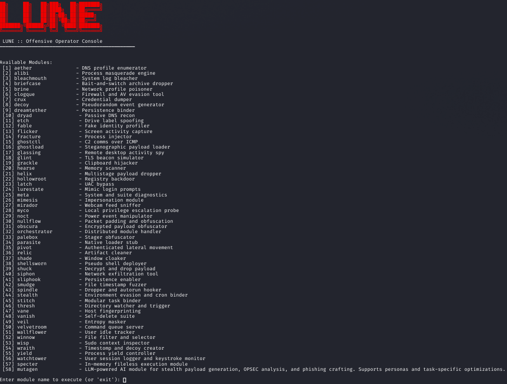
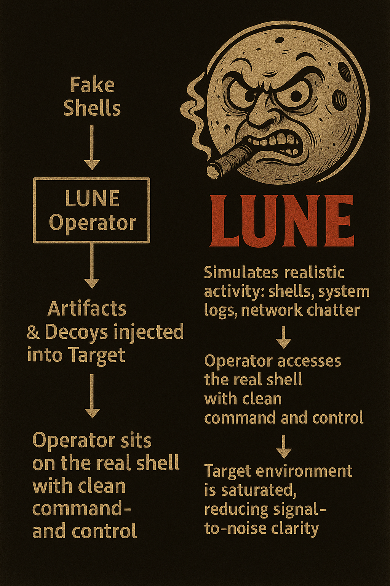

<p align="center">  
   
</p>

<h2 align="center">A misdirection driven offensive toolkit for cognitive disruption</h2>

<p align="center">
  LUNE is a psychological cyber weapon an offensive decoy system engineered for red teams who trade in deception, not just disruption.<br>
  It doesn't just simulate threats it weaponizes perception.<br><br>
  By injecting synthetic artifacts, false indicators, and digital disinformation, LUNE builds deepfake operational realities that send defenders chasing ghosts through a maze of mirrors.<br>
  Designed for Kali and kin, it operates where truth is fluid, and visibility is just another vector to exploit.
</p>

<p align="center"><i>🧨 Note: Spicy by design—this copy doesn’t brief well in boardrooms, but it hits different in war rooms and late-night ops chats.</i></p>

<hr>

<h2 align="center">Philosophy</h2>

<p align="center">
Most decoy and misdirection frameworks are designed for defense—to confuse attackers or distract from real assets.<br>
LUNE flips the model. This framework is built for offensive operators who run deception as a weapon—flooding environments with crafted noise, fake shells, forged events, and manipulated telemetry.<br><br>
LUNE is what you reach for when subtlety is no longer the goal—when it’s time to go in loud and dirty.<br>
Think of it as offensive misdirection at scale—a psychological smokescreen that disorients defenders while the operator sees through the chaos like Riddick in the dark.<br>
You're not just hiding. You're weaponizing confusion.
</p>

<hr>

<h2 align="center">Features</h2>

<p align="center">
  Modular deception and implant ecosystem<br>
  Operator-side TUI interface<br>
  Real-time decoy injection, log pollution, false trail planting<br>
  Plug-and-play modules and context-aware logic<br>
  Post-exploitation toolkit integration<br>
  Payload orchestration and noise layering<br>
  Terminal and GUI entrypoints<br>
  Designed for adaptability in offensive operations
</p>


<p align="center">  
   
</p>

<p align="center">  
   
</p>

<h2 align="center">Modules</h2>

<p align="center">
<code>aether</code>: Cloud service fingerprinting and profiling<br>
<code>alibi</code>: Process name masquerading for evasion<br>
<code>bleachmouth</code>: WAF detection and bypass utility<br>
<code>briefcase</code>: Exfiltration via compressed payloads<br>
<code>brine</code>: DNS tunneling communication module<br>
<code>clogque</code>: Log tampering and artifact cleanup<br>
<code>crux</code>: Credential dumper for local/remote stores<br>
<code>decoy</code>: False indicator deployment for attribution masking<br>
<code>dreamtether</code>: Persistence via systemd unit injection<br>
<code>dryad</code>: Passive domain recon with WHOIS, DNS, etc.<br>
<code>etch</code>: In-memory command and payload injector<br>
<code>fable</code>: Fake identity and infrastructure generator<br>
<code>flicker</code>: Timing and jitter manipulation for stealth<br>
<code>fracture</code>: ACL misconfiguration scanner and exploiter<br>
<code>ghostctl</code>: Remote agent manager for implanted hosts<br>
<code>ghostload</code>: Stealthy remote payload loader<br>
<code>glassing</code>: Browser reconnaissance and fingerprinting<br>
<code>glint</code>: TLS beacon simulator for C2 traffic emulation<br>
<code>grackle</code>: Port knocker and firewall rule trigger<br>
<code>hearse</code>: Forensics countermeasure, clears traces<br>
<code>helix</code>: Invoke-obfuscation for Python payloads<br>
<code>hollowroot</code>: Process hollowing and rootkit behavior simulation<br>
<code>latch</code>: Token manipulation and impersonation tool<br>
<code>lurestate</code>: Drive-by payload setup and link lures<br>
<code>meta</code>: Framework introspection and health check<br>
<code>mimesis</code>: User-agent and header randomizer<br>
<code>mirador</code>: Surveillance tool for webcam and mic access<br>
<code>myco</code>: Lateral movement via shared folders or drives<br>
<code>noct</code>: Network share enumeration and drop<br>
<code>nullflow</code>: Firewall evasion via null packet streams<br>
<code>obscura</code>: File obfuscator and anti-sandbox encoder<br>
<code>orchestrator</code>: Command dispatcher for chained ops<br>
<code>palebox</code>: Auto-encrypt and encode payloads<br>
<code>parasite</code>: Native-code loader for .so or .dll injection<br>
<code>pivot</code>: Authenticated lateral movement via SSH<br>
<code>relic</code>: Archive scanner and embedded payload injector<br>
<code>shade</code>: Power state abuse for stealth execution<br>
<code>shellsworn</code>: Reverse shell generation and bind hooks<br>
<code>shuck</code>: Dropper with XOR/base64 decryption routine<br>
<code>siphon</code>: Credential and token siphoning<br>
<code>sliphook</code>: Startup persistence via shell profile backdoors<br>
<code>smudge</code>: Clipboard hijacker and credential skimmer<br>
<code>spindle</code>: Dropper with .bashrc and crontab autorun<br>
<code>stealth</code>: Environment evasion + cron persistence<br>
<code>stitch</code>: Payload combiner and execution wrapper<br>
<code>thresh</code>: Privilege escalation enumeration<br>
<code>vane</code>: Network topology mapper via passive sniffing<br>
<code>vanish</code>: Suite cleaner and self-delete module<br>
<code>veil</code>: Payload encoder and sandbox evasion wrapper<br>
<code>velvetroom</code>: Encrypted payload vault and delivery<br>
<code>wallflower</code>: Host recon + anti-debug countermeasures<br>
<code>winnow</code>: File system harvester (docs, creds)<br>
<code>wisp</code>: Micro beacon emitter (low signature C2)<br>
<code>wraith</code>: Active process and service cloaker<br>
<code>yield</code>: Exfil via timing and protocol diversion<br>
</p>

<h2 align="center">Quickstart</h2>

```bash
git clone https://github.com/GnomeMan4201/Lune.git
cd Lune
chmod +x setup.sh
./setup.sh
source lune_env/bin/activate
python3 -m lune.lune_tui  # TUI launcher
