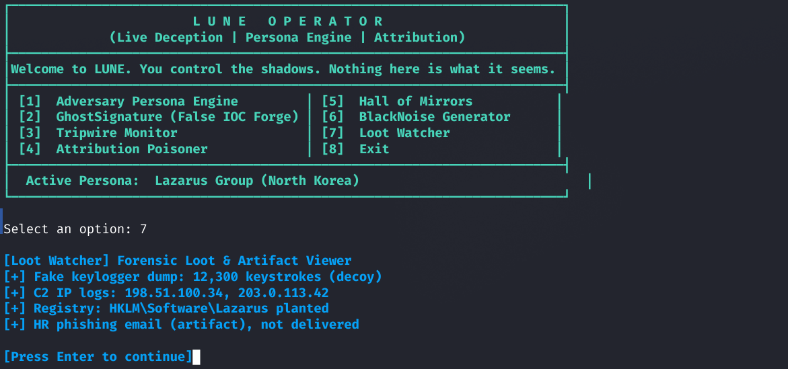
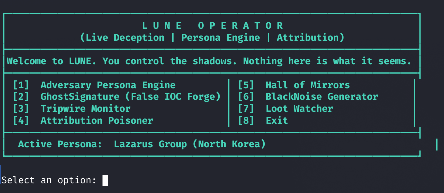
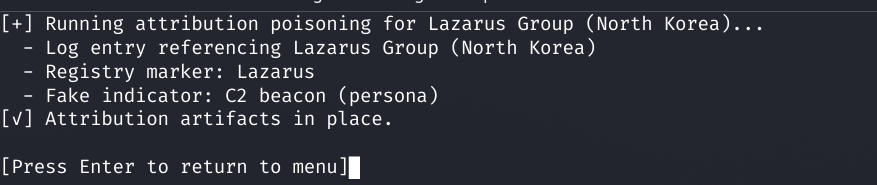
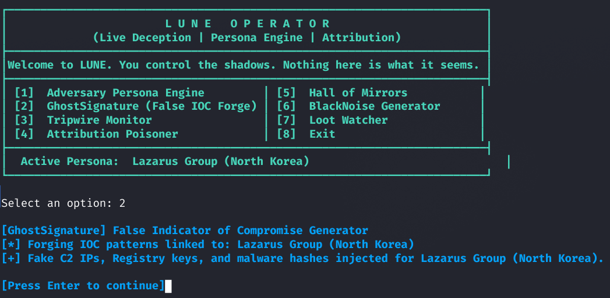
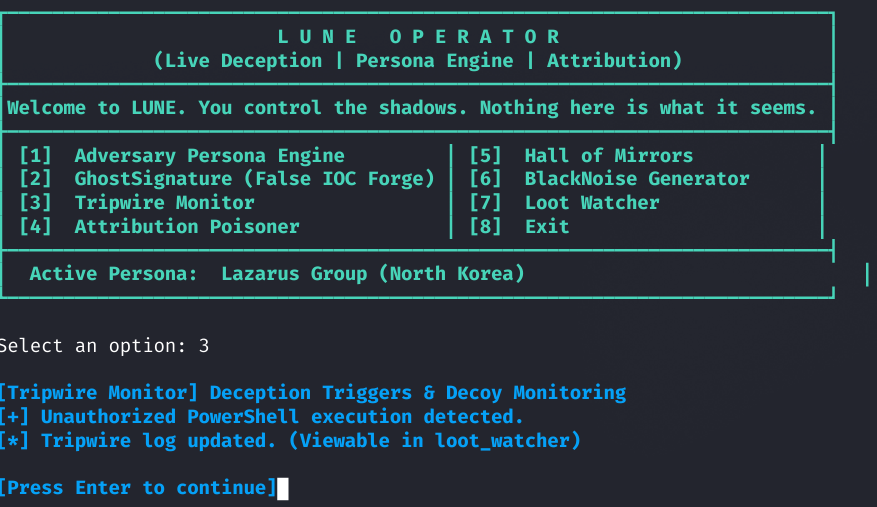
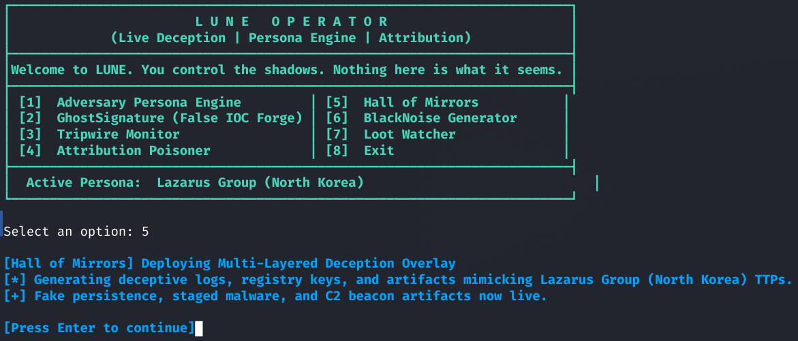
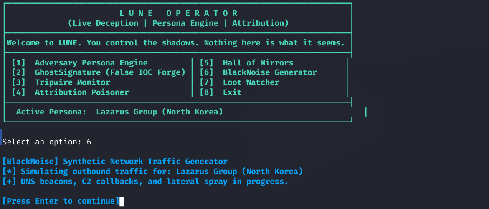

<p align="center">
  
</p>

<h1 align="center">LUNE</h1>
<p align="center"><em>Modular Adversary Simulation & Live Deception Framework</em></p>

---

## Why LUNE?

Most “red team” projects are either bloated, try-hard, or built for looks over substance.  
**LUNE** was built for real operators who want complete control, real deception, and adversary simulation with none of the fluff.  
You get modular beaconing, persona engines, attribution poison, and enough customization to fake out even seasoned DFIR analysts.

LUNE is not about pretending to be nation-state; it’s about teaching you the tradecraft, letting you pull the strings, and pushing the boundaries of adversary simulation—no clickbait, no enterprise sales pitch.

---

## Features

- Modular adversary personas, with pluggable tradecraft modules
- Persona attribution engine (frame any group, poison attributions, stage artifacts)
- Decoy infrastructure: tripwire monitor, GhostSignature (false IOCs), Hall of Mirrors, and more
- Synthetic C2 traffic, fake malware artifacts, staged logs, and realistic noise
- Full transparency—no hidden BS, no “just trust us” magic
- Professional documentation, real tests, robust and auditable code

---

## Install & Quickstart

Clone and set up your virtual environment:

```bash
git clone https://github.com/GnomeMan4201/Lune.git
cd Lune
python3 -m venv .venv
source .venv/bin/activate
pip install -r requirements.txt

Launch the C2 server:

python3 server/c2.py

Deploy a beaconing agent (on test VM or different terminal):

python3 agents/lune_agent.py

Queue a task for an agent:

curl -X POST http://localhost:5000/api/queue/agent_001 \
  -H "Content-Type: application/json" \
  -d '{"task": "whoami"}'

How it Works

    Operator: Runs LUNE, selects/adapts adversary personas, launches modules, and stages deception artifacts.

    Agent: Polls C2, executes received tasks, forges evidence, and simulates attacker activity.

    Modules: Plug in new personas, fake IOCs, network noise, and more—swap/extend without hacking core logic.

    Artifacts & Forensics: Plant logs, registry keys, IP addresses, and more to poison blue team investigations.

Project Structure

Lune/
├── agents/                # Beaconing agents, persona engines
├── server/                # Flask C2 and control logic
├── modules/               # All modular deception modules
├── data/                  # Queued tasks, agent state, dropped artifacts
├── assets/                # Logo, screenshots, mock CLI output
├── docs/                  # Full documentation set
├── tests/                 # Unit and functional tests
├── requirements.txt
├── README.md
└── ... (additional .md docs)

Operator Experience
<p align="center">        </p>
Documentation

    ARCHITECTURE.md: System & module design

    PROJECT_STRUCTURE.md: Files, modules, and layout

    DESIGN_NOTES.md: Deep-dive tradecraft, logic, and intent

    CONTRIBUTING.md: For those who want to build on LUNE

License

MIT License
Disclaimer

LUNE is for legal research, red team simulation, and education only.
Use on systems you own or have explicit permission to test.
