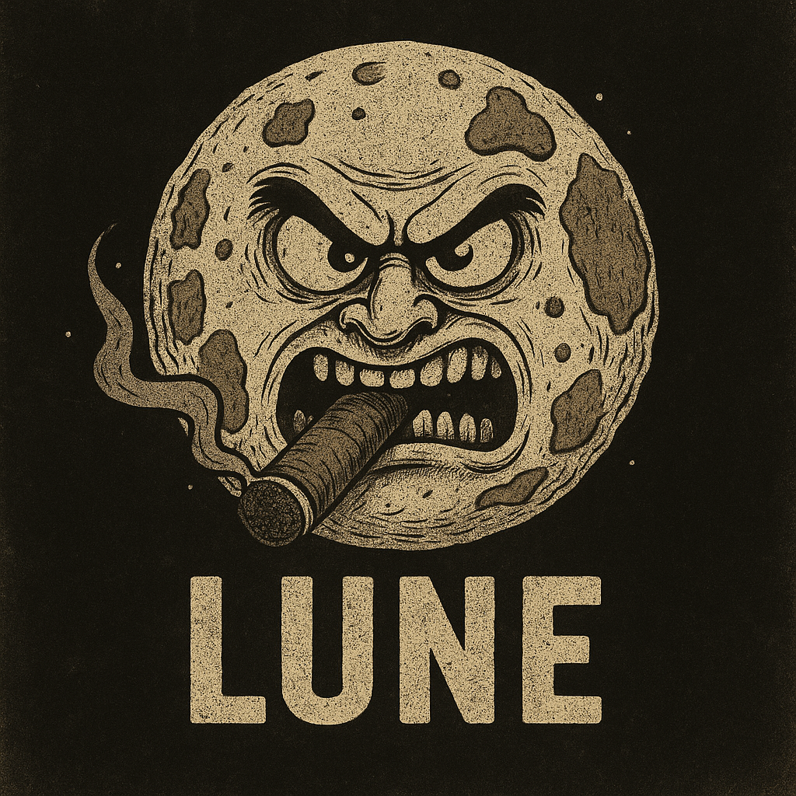
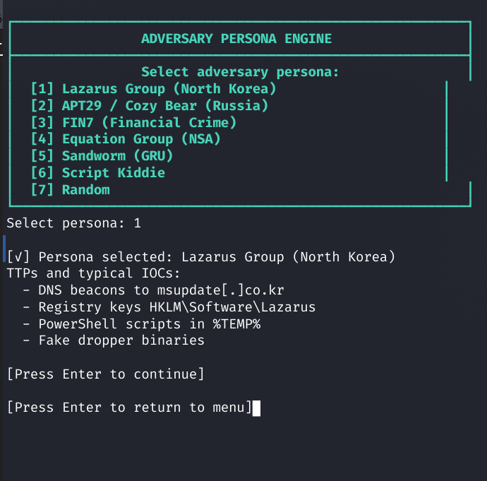
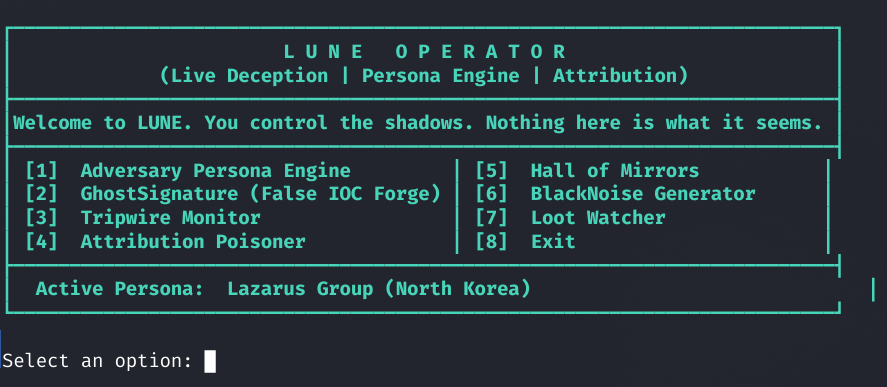
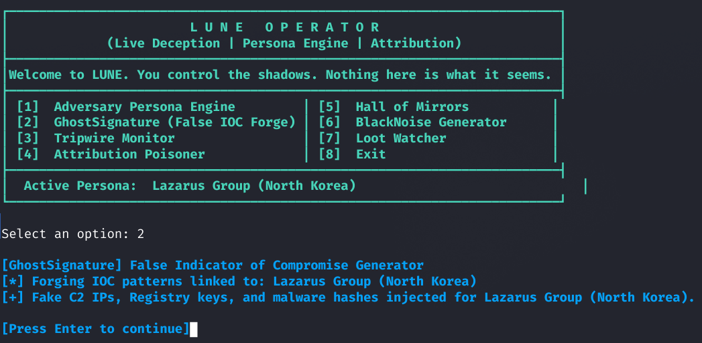
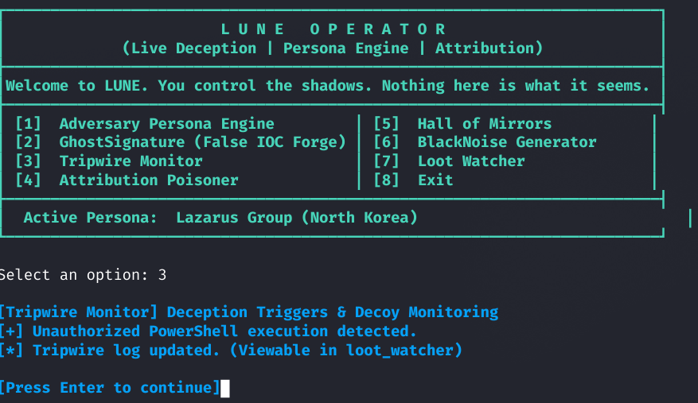
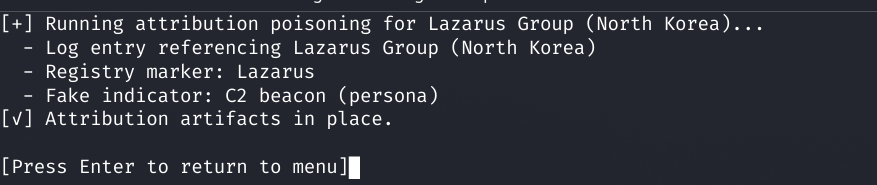
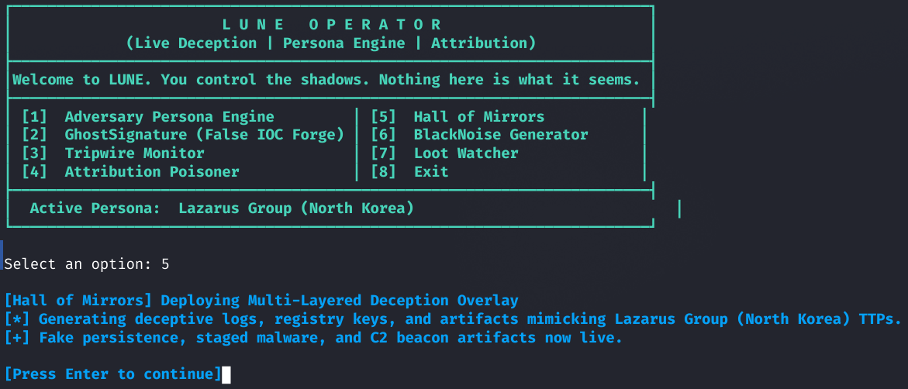
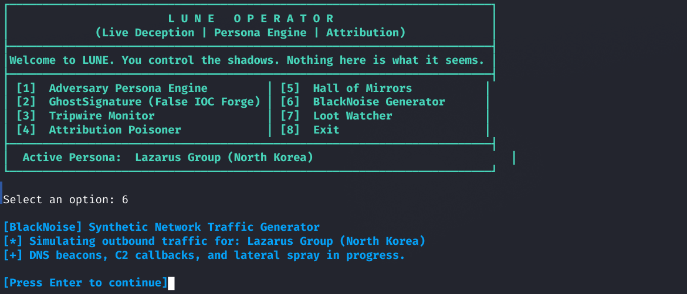

  

<h1 align="center">LUNE/h1>

  <b>Live Deception &nbsp;|&nbsp; Persona Engine &nbsp;|&nbsp; Attribution Poisoning</b> 
   
  LUNE is a next generation red team and adversary simulation toolkit. 
  Not another scanner. Not another wrapper. 
  This is psychological warfare, deception, and chaos—refined into a hacker’s TUI you’ll actually want to use.

---

<h2 align="center">Screenshots</h2>

  <b>Menu:</b> 
    
  <b>Persona Engine:</b> 
    
  <b>GhostSignature:</b> 
    
  <b>Tripwire Monitor:</b> 
    
  <b>Hall of Mirrors:</b> 
    
  <b>BlackNoise:</b> 
    
  <b>Loot Watcher:</b> 
   

---

<h2 align="center">What is LUNE?</h2>

LUNE lets you: 
- <b>Select an adversary persona</b> (Lazarus, APT29, FIN7, NSA Equation Group, Script Kiddie, and more) 
- <b>Live generate deception artifacts</b>: DNS beacons, registry keys, fake logs, malware stubs, C2 traffic, and more matching real world threat group TTPs 
- <b>Flood blue teams and DFIRs with noise and false indicators</b> (real “attribution poisoning”) 
- <b>Spin up multi layered decoy environments</b> with just a few keystrokes 
- <b>Export a full simulated DFIR report</b> showing all artifacts planted 
- <b>Clean up instantly</b> (stealth kill switch) 
- <b>All from a terminal menu you can actually be proud of</b>

---

<h2 align="center">Features</h2>

- <b>Adversary Persona Engine</b> — Pick your APT, see their tactics, simulate their artifacts, and poison attribution like a pro. 
- <b>GhostSignature</b> — Forge false IOCs, malware signatures, and staged C2s for any persona. 
- <b>Tripwire Monitor</b> — Simulate decoy tripwires and detection triggers with realistic events. 
- <b>Attribution Poisoner</b> — Drop artifacts that frame your adversary persona, not yourself. 
- <b>Hall of Mirrors</b> — Multi-layer deception overlay: fake persistence, staged logs, and more. 
- <b>BlackNoise</b> — Synthetic network traffic generator, DNS beacons, C2 callbacks. 
- <b>Loot Watcher</b> — View all decoy loot, artifacts, and planted evidence from a single place. 
- <b>Stealth Cleanup</b> — Nuke every planted artifact in one move (clean exit for OPSEC).

---

<h2 align="center">Install & Usage</h2>

<b>Requirements:</b> 
Python 3.8+ 
Runs on Kali, Ubuntu, most Linux distros out-of-the-box

<b>Quickstart:</b>

  
<code>
git clone https://github.com/GnomeMan4201/Lune.git 
cd Lune 
python3 -m venv venv 
source venv/bin/activate 
pip install -r requirements.txt 
python3 lune_operator.py
</code>

To run globally (optional): 
<code>
sudo ln -s $PWD/lune_operator.py /usr/local/bin/lune 
sudo chmod +x /usr/local/bin/lune_operator.py 
lune
</code>

---

<h2 align="center">Why LUNE?</h2>

Most “red team tools” are just wrappers. 
LUNE is a psychological ops engine, an adversary persona system, and a fully modular deception lab that pushes the boundaries of attribution, obfuscation, and defense evasion—<b>in a way blue teams haven’t seen before</b>.

---

<h2 align="center">License</h2>

MIT License. 
See <a href="LICENSE">LICENSE</a> for details.

---

<h2 align="center">Credits</h2>

Developed by <b>NMAPKin</b> 
Inspired by real-world threat actor tradecraft and the need for chaos.  
<b>Stay unpredictable. Welcome to the arena.</b>

