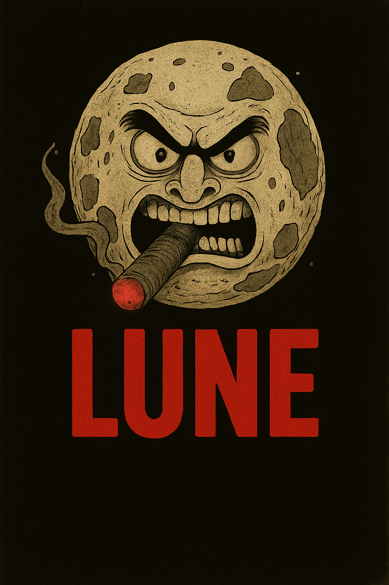
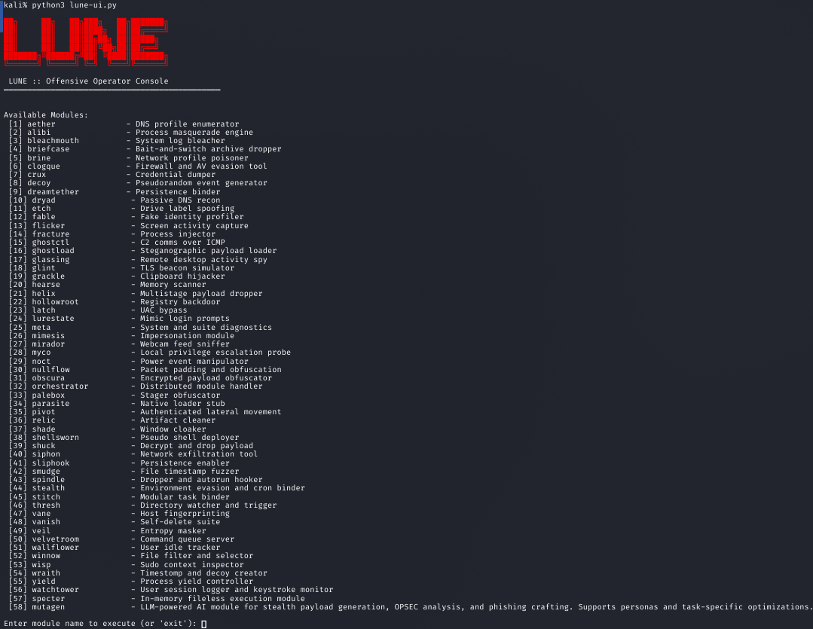

<p align="center">
  
</p>

<h3 align="center"><code> Psychological Deception Engine for Red Team Operators</code></h3>

---

## [ PHILOSOPHY ]
<p align="center">
  <code>LUNE DROPS A SMOKE GRENADE - WHILE GIVEN THE OPERATOR RIDDICK VISION TO SEE EVERYTHING CLEARLY</code><br>
  <code>A false-reality shell. A trap-filled arena. A game of misdirection, not brute force.</code>
</p>

---

## [ FEATURES ]
<p align="center">
  Fake Operator Shell<br>
  Real-Time Decoy Beacons<br>
  Fracture & IOC Injection<br>
  Artifact Ghostloading<br>
  Modular Deception Scripts<br>
  Self-Diagnostic Module
</p>

---

## [ MODULES ]
<p align="center">

| Module         | Description                                      |
|----------------|--------------------------------------------------|
| `lune.py`       | Entrypoint shell sim (launches fake environment) |
| `decoy.py`      | Loads and displays decoy IOCs from JSON file     |
| `fracture.py`   | Injects fake commands and IOCs into shell        |
| `ghostload.py`  | Drops covert payloads for realism/noise          |
| `lurestate.py`  | Emits operator "heartbeat" signals (RT beacon)   |
| `lune-check.py` | Self-diagnostic scan of module readiness         |

</p>

---

<h3 align="center"><code>OPERATOR MODULES MENU</code></h3>

<p align="center">
  
</p>

<p align="center">
  <code>Modular operator interface featuring 58 payload, recon, and obfuscation modules.</code>
</p>

---

## [ QUICKSTART ]

```bash
git clone https://github.com/YourUsername/Lune.git
cd Lune
python3 lune-launcher.py
