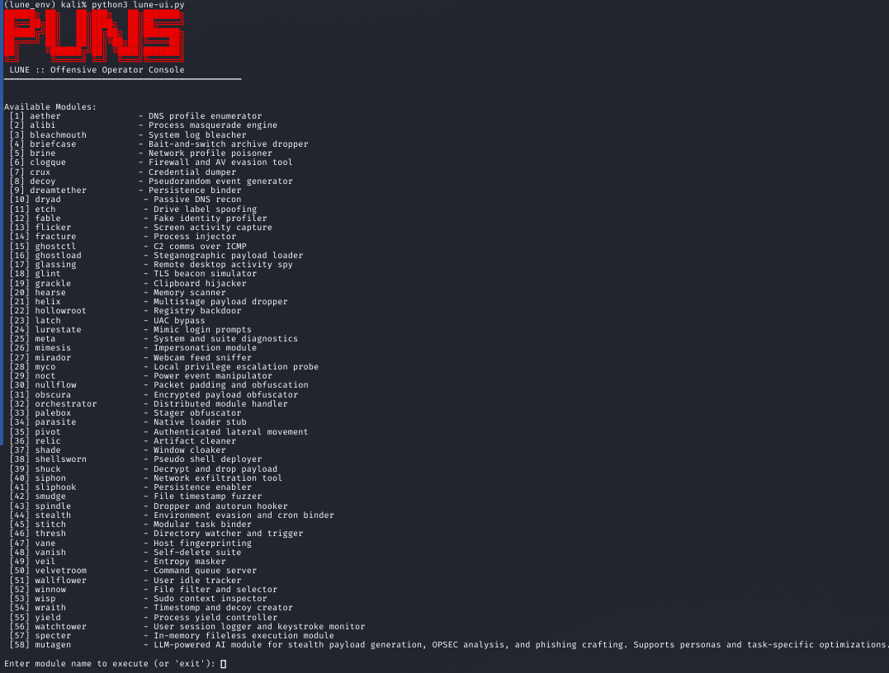
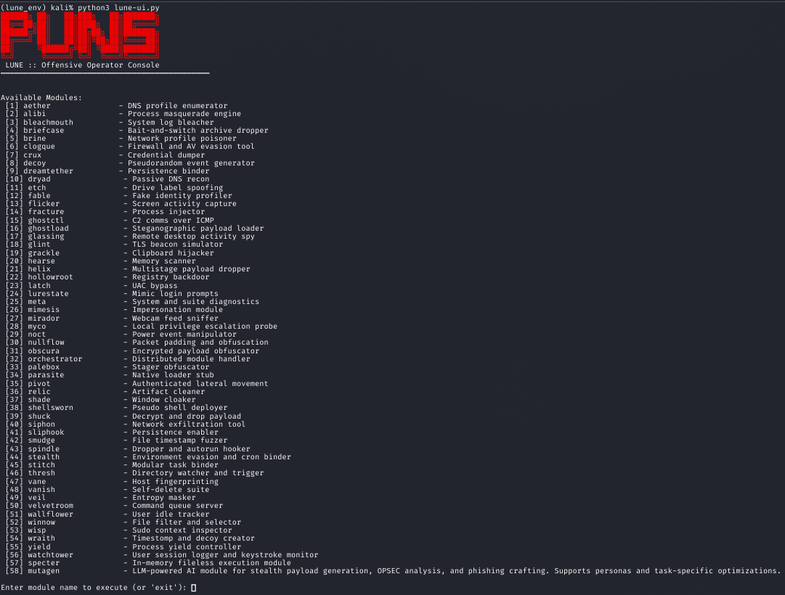

<p align="center">
  
</p>

# Lune

**LUNE** (Logical Uncertainty & Network Evasion) is a modular red team framework focused on adversary simulation, deception environments, and operational misdirection.

Designed to run on Kali Linux and similar environments, LUNE allows operators to construct complex false realities inside target systems using layered decoys, injected noise, and deceptive behaviors.

---

## Features

- Modular deception and implant ecosystem
- Operator-side TUI interface
- Real-time decoy injection, log pollution, false trail planting
- Modular design: plug-and-play scripts, drop-ins, and context-aware logic
- Post-ex toolkit integration
- Payload orchestration and noise layering
- Terminal and GUI entrypoints
- Designed for adaptability in offensive operations

<p align="center">
  
</p>

---

## Quickstart

```bash
git clone https://github.com/GnomeMan4201/Lune.git
cd Lune
chmod +x setup.sh
./setup.sh
source lune_env/bin/activate

python3 -m lune.lune_tui  # TUI launcher
